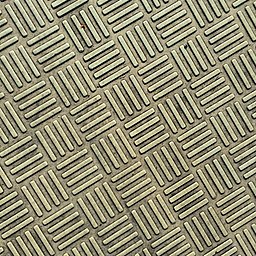
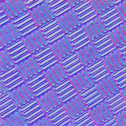
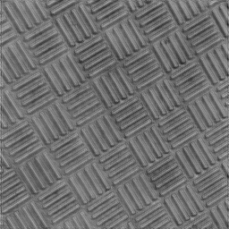
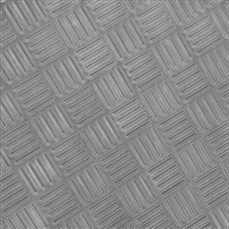

# Material Map Generator

Easily create AI generated Normal maps, Displacement maps, and Roughness maps.

|Input|Output|Output|Output|
|:-:|:-:|:-:|:-:|
|Diffuse Texture|Normal Map|Displacement Map|Roughness Map|
|||||

Before you begin, make sure you have numpy, opencv-python, and pytorch installed (`pip install torch --index-url https://download.pytorch.org/whl/cu117`).

To run, put images in the `input` folder, and type `python generate.py`. Output images will then be placed in the `output` folder, with the type of map appended to the file name.

To run on CPU instead of GPU (not recommended) use the `--cpu` flag.

If you run out of VRAM while generating the maps, try decreasing the tile size by using the `--tile_size` flag. `--tile size 512` is the default. You can also increase this if your GPU has a lot of VRAM.

To avoid seams and other artifacts that can be created, there are 3 optional flags included: `--seamless`, `--mirror`, and `--replicate` for creating different kinds of seamlessness or padding.

To create material maps in the format used by Ishiiruka Dolphin, use the `--ishiiruka` flag. These can then be converted using Ishiiruka's texture tool. If you want to skip having to use the texture tool, you can use the `--ishiiruka_texture_tool` flag instead, and it will generate the textures in that format instead.

Thanks to Xinntao for the ESRGAN architecture used to train these models. The included models are lighter than regular ones and therefore require less VRAM to process the images with.
